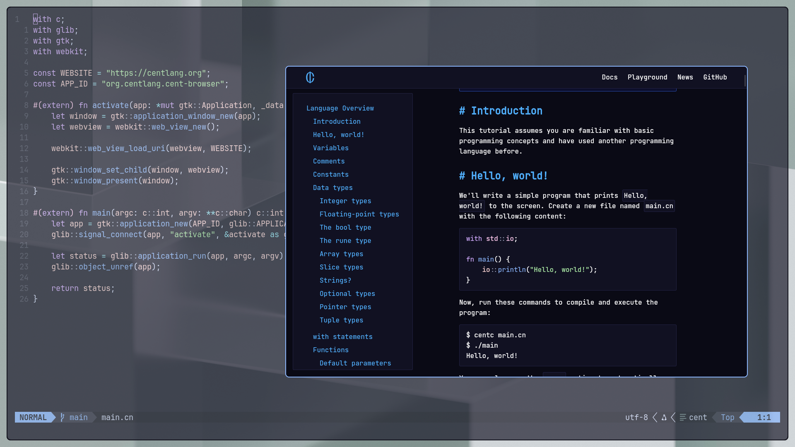

# cent-browser

Proof of concept WebKitGTK-based browser written in Cent.



## Building

Make sure you have the dependencies installed:

- Cent
- WebKitGTK
- Make

Clone the repository:

```sh
$ git clone https://github.com/centlang/cent-browser && cd cent-browser
```

Build:

```sh
$ make
```

## Running

```sh
$ build/cent-browser
```
